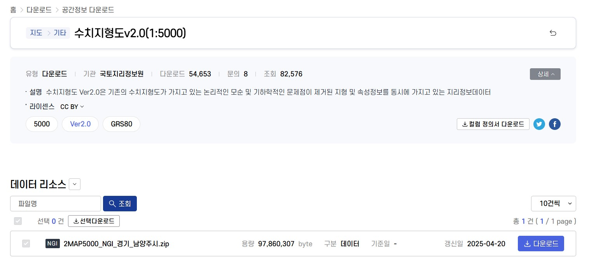
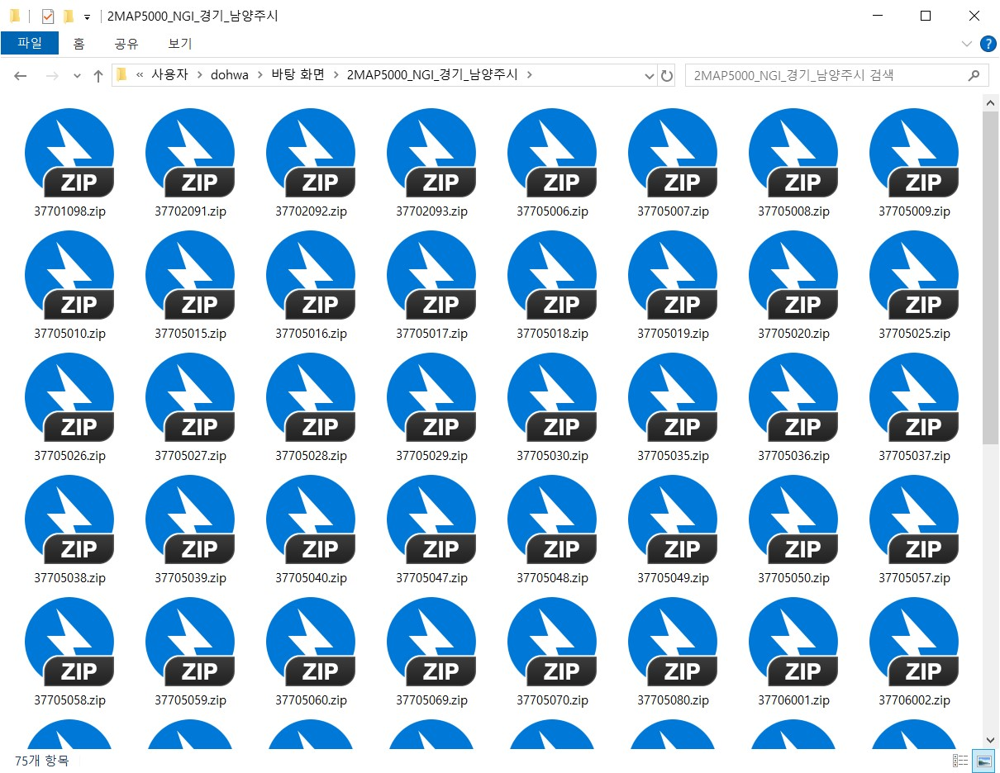
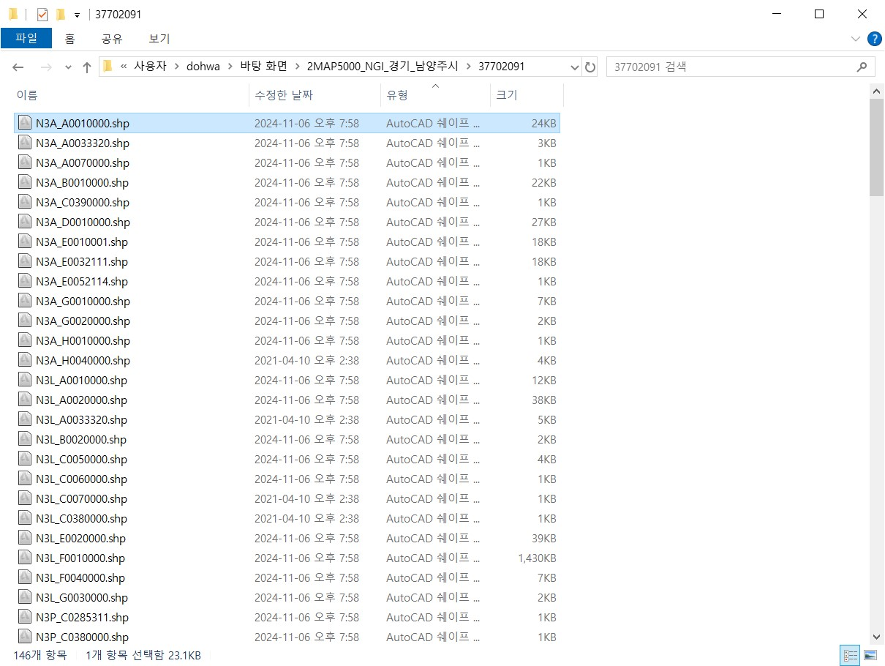
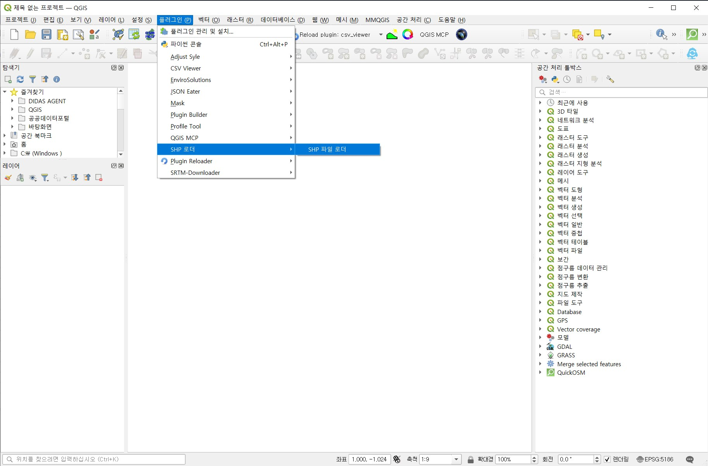
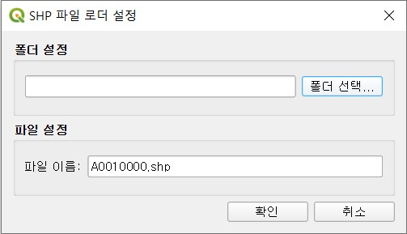
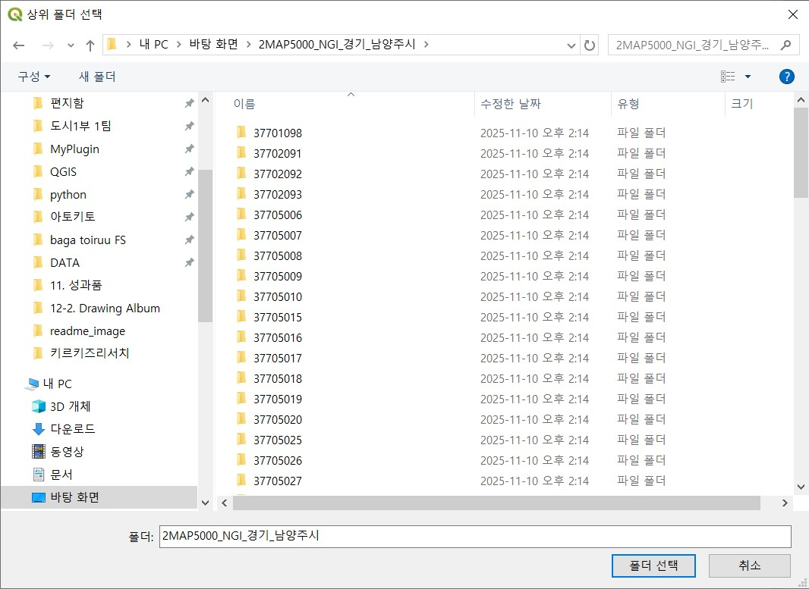
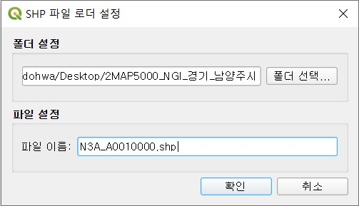
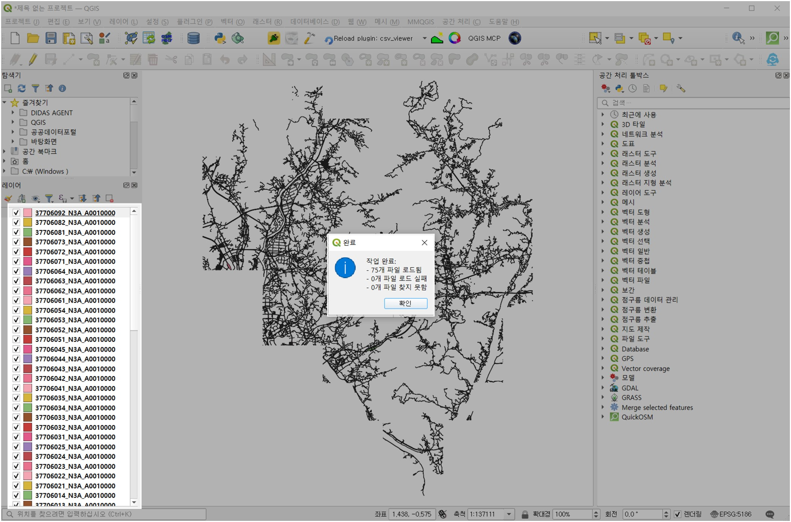

# GIS SHP Loader

도엽별 폴더 내부에 있는 shp 파일을 일일이 업로드해야하는 번거로움을 덜어주는 QGIS용 플러그인입니다. 

## 브이월드 수치지형도(예시)
- **Vworld에서 수치지형도 등을 내려받는 상황**입니다.

- **Vworld에서 수치지형도 등을 내려받으면 도엽별로 폴더가 만들어지고**, 동일한 파일명(예: `N3A_A0010000.shp`)이 각 도엽별 폴더 안에 들어있습니다.

- QGIS에 불러오려면 보통 폴더를 하나씩 열어 파일을 선택해야 하므로 **시간이 오래 걸리고 귀찮습니다**.
- 이 플러그인은 **루트 폴더(도엽 폴더들이 모여 있는 상위 폴더)와 파일명만 입력**하면, 하위 모든 폴더에서 해당 파일을 찾아 한 번에 레이어로 로드합니다.

## 어떻게 한번에 불러오나요?
1. 플러그인을 설치한 후 '플러그인' → 'SHP로더' → 'SHP 파일로더' 클릭
  

2. 대화 상자에서 **폴더 선택**을 선택 후 루트폴더(도엽 폴더들이 모여있는 폴더) 경로를 선택합니다.
  
  

3. 파일 이름을 선택합니다.(확장자명을 함께 입력하세요)
    

4. 확인 버튼을 누르면 업로드 완료!
   

## 설치 방법

1. QGIS 플러그인 **ZIP 파일을 다운로드**합니다.
   1.1 디다스 다운로드
   
   1.2 Github 다운로드(<>CODE → Download ZIP)
   

2. QGIS에서 **플러그인 관리자**를 클릭 후 다운로드한 ZIP 파일을 로드합니다.
   
   

## 핵심기능
- **일괄 로드**: 지정한 루트 폴더 아래 모든 하위(도엽) 폴더에서 같은 파일명을 자동으로 탐색하여 한 번에 로드
- **깔끔한 레이어 이름**: `폴더명_파일명` 형식으로 레이어가 생성되어 도엽을 구분하기 쉬움
- **요약 결과 안내**: 몇 개가 성공/실패했는지 메시지로 확인
- **대량 처리 친화적**: 많은 도엽 폴더에서도 반복 클릭 없이 처리

## 자주 묻는 질문(FAQ) · 문제 해결

- **입력한 파일명이 폴더마다 조금씩 다르면?**  
  이 플러그인은 “같은 파일명”을 전제로 합니다. 파일명이 다른 경우에는 일치하도록 정리한 뒤 사용하세요.  

- **일부 도엽 폴더에 해당 파일이 없으면?**  
  해당 폴더는 건너뛰고 나머지만 로드됩니다. 완료 메시지에서 누락 개수를 확인하세요.  
  
- **레이어 이름이 깨져 보일 때**  
  폴더명이 한글/특수문자인 경우 QGIS 설정이나 인코딩 영향으로 표시가 달라질 수 있습니다.  

- **경로에 한글/공백이 많아요**  
  가능하면 간단한 경로를 사용하고, 네트워크 드라이브보다는 로컬 디스크 경로를 권장합니다.  

- **로드가 너무 오래 걸리거나 응답이 없을 때**  
  도엽 수가 매우 많으면 시간이 걸릴 수 있습니다. 잠시 기다리거나 폴더를 나눠서 처리해 보세요.  

## 개발자용 안내

개발·버전업·패키징·릴리스 절차 등 상세한 개발 문서는 `README_for_developers.md`를 참고하세요.

## 라이선스

이 프로젝트는 MIT 라이선스 하에 배포됩니다. 자세한 내용은 [LICENSE](LICENSE) 파일을 참조하세요.

## 문의

버그를 발견하거나 기능을 제안하고 싶으시면 [GitHub Issues](https://github.com/qbong1010/gis_shp-loader/issues)에 등록하거나 메일을 보내주세요
urbanbong@dohwa.co.kr

## 크레딧

개발: QBong from DOHWA